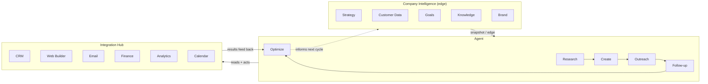

# Ingenium


Ingenium is a self-contained Python package for a two-hemisphere business intelligence and execution loop.

## What this is / isn't

Ingenium is self-contained: it runs independently of the PWA digital business card and the `robot_agi/` package in this repository.

## Quick start

From the repo root:

```bash
# install
# no extra dependencies are required; Ingenium is stdlib-only

# run tests
python3 -m unittest discover -s ingenium/tests -v

# run demo
python3 -m ingenium.demo

# run dashboard
python3 -m ingenium.web.server
# -> open http://localhost:8000
```

## Prerequisites and setup

- **Python:** use Python 3.12 (the provided container also uses `python:3.12-slim`)
- **Dependencies:** none beyond the Python standard library
- **Package status:** Ingenium is stdlib-only and structured as a package, but this repo does not currently ship packaging metadata such as `pyproject.toml` or `setup.py`
- **How to run it:** run commands from the repo root, or otherwise ensure the repository root is on `PYTHONPATH`

## Concept

Ingenium has two hemispheres connected through a shared set of integrations:

- **Company Intelligence** — strategy, customer data, goals, knowledge, and brand
- **Agent** — research, create, outreach, follow-up, and optimize

Those integrations let the brain **think** (build context), **connect** (initialize adapters), and **execute** (run the agent pipeline against that context and those systems).



## Architecture

| Phase | Responsibility | Main component |
| --- | --- | --- |
| Think | Build the current edge context for an objective | `CompanyIntelligence.snapshot()` via `Ingenium.think()` |
| Connect | Initialize the six adapters the system uses | `IntegrationHub.connect_all()` via `Ingenium.connect()` |
| Execute | Run the staged agent workflow against the edge and integrations | `AgentSide.execute_pipeline()` via `Ingenium.execute()` |

The execute phase runs five stages in order:

- **Research** — reads CRM, analytics, and priorities to understand the objective
- **Create** — drafts and publishes an on-brand asset via the web builder
- **Outreach** — emails the target segment and logs the touch in CRM
- **Follow-up** — schedules a calendar touchpoint for people reached
- **Optimize** — reads analytics and finance results back into the next cycle

## Structure

```text
ingenium/
├── core/
│   ├── brain.py             # Ingenium: think() / connect() / execute()
│   └── integration_hub.py   # Owns and connects the six integrations
├── company_intelligence/    # strategy, customer_data, goals, knowledge, brand
├── agent/                   # research, create, outreach, follow_up, optimize
├── integrations/            # crm, web_builder, email, finance, analytics, calendar
├── web/                     # stdlib-only HTTP server + HTML dashboard
│   ├── server.py
│   └── static/              # index.html, style.css, app.js
└── tests/
    ├── test_brain.py
    └── test_web.py
```

## Public API

### `Ingenium`

The top-level orchestrator exposed by `from ingenium import Ingenium`.

```python
from ingenium import Ingenium

brain = Ingenium()
```

Constructing it gives you:

- `brain.company_intelligence` — the editable Company Intelligence hemisphere
- `brain.hub` — the shared integration hub
- `brain.agent_side` — the staged agent pipeline

### `company_intelligence`

`brain.company_intelligence` is a `CompanyIntelligence` object for loading the business context Ingenium will think over.

```python
ci = brain.company_intelligence
ci.strategy.set_positioning("AI ops partner for local service businesses")
ci.customer_data.upsert_record("cust-1", {"email": "lead@example.com"})
ci.brand.set_voice("direct, confident, no fluff", ["clear", "bold"])
```

### `think()`

`brain.think(objective)` returns the objective plus the current company snapshot:

```python
thought = brain.think("Launch fall tune-up campaign")
# {"objective": "...", "edge": {...}}
```

### `connect()`

`brain.connect()` connects the six integrations and returns their statuses:

```python
statuses = brain.connect()
# {"crm": {"connected": True}, "web_builder": {"connected": True}, ...}
```

### `execute()`

`brain.execute(objective)` runs think → connect → execute and returns the full report:

```python
report = brain.execute("Launch fall tune-up campaign")
```

Expected report shape:

```json
{
  "objective": "Launch fall tune-up campaign",
  "edge": {
    "strategy": {},
    "customer_data": {},
    "goals": {},
    "knowledge": {},
    "brand": {}
  },
  "integrations": {
    "crm": {"connected": true},
    "web_builder": {"connected": true},
    "email": {"connected": true},
    "finance": {"connected": true},
    "analytics": {"connected": true},
    "calendar": {"connected": true}
  },
  "pipeline": {
    "research": {},
    "create": {},
    "outreach": {},
    "follow_up": {},
    "optimize": {}
  }
}
```

The `pipeline` keys map to the five agent stages in execution order; `follow_up` is the code-facing key, while “follow-up” is used in prose.

## Usage modes

### Dashboard

```bash
python3 -m ingenium.web.server
```

Starts the stdlib-only HTTP dashboard at `http://localhost:8000`.

### CLI demo

```bash
python3 -m ingenium.demo
```

Populates a sample company context, runs one full cycle, and prints the `execute()` report as JSON.

### Tests

```bash
python3 -m unittest discover -s ingenium/tests -v
```

Runs the package test suite from the repo root.

## HTML dashboard

`ingenium/web/` serves an HTML dashboard for the brain with no third-party dependencies.

The dashboard:

- shows both hemispheres and the six integrations live
- lets you enter an objective and run a full think → connect → execute cycle
- updates the Company Intelligence cards, integration badges, and Agent stages in place
- keeps state **in memory only** inside the running server process

It also exposes two JSON endpoints:

- `GET /api/edge` — returns the current company intelligence snapshot
- `POST /api/execute` with `{"objective": "..."}` — returns the same report shape as `Ingenium.execute()`

## Running in a container (Podman / Rancher Desktop / Docker)

The repo root `Containerfile` packages `ingenium/` as a standalone image with no dependencies beyond the Python standard library. Building it also runs the test suite.

```bash
# Podman (or Podman Desktop's embedded CLI, or Rancher Desktop set to the
# Podman/moby backend):
podman build -t ingenium -f Containerfile .
podman run --rm -p 8000:8000 ingenium
# -> open http://localhost:8000

# Docker works identically:
docker build -t ingenium -f Containerfile .
docker run --rm -p 8000:8000 ingenium
```

The default command runs the dashboard (`ingenium.web.server`) on port 8000. For the one-shot CLI demo instead:

```bash
podman run --rm ingenium python3 -m ingenium.demo
```

## Development notes

- **Tests live in** `ingenium/tests/`, with pipeline coverage in `test_brain.py` and dashboard/API coverage in `test_web.py`
- **To add a new integration,** implement or extend an adapter in `ingenium/integrations/` and register it in `IntegrationHub.adapters` in `ingenium/core/integration_hub.py`
- **To add a new agent stage,** add the stage under `ingenium/agent/`, wire it into `AgentSide.__init__()` and `AgentSide.execute_pipeline()`, and update tests that assert pipeline shape/order
- **Dashboard state is in-memory only;** restarting `python3 -m ingenium.web.server` resets CRM activity, sent emails, scheduled follow-ups, and analytics history

## Extending with real integrations

Every adapter in `ingenium/integrations/` extends `Integration` (`ingenium/integrations/base.py`), which requires a `connect()` call before use. Replacing an adapter's in-memory logic with a real API client lets the rest of the brain keep working unchanged.
