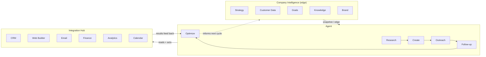

# Ingenium

**A two-hemisphere engine that turns what a company knows into what it does.**

Ingenium pairs a company's knowledge (strategy, customers, goals, knowledge,
brand) with an agent pipeline (research → create → outreach → follow-up →
optimize) and runs the second against the first to execute a business
objective end to end.

> **Scope.** Ingenium is a standalone Python package (`ingenium/`). It is
> completely independent of the two other layers in this repo — the PWA
> digital business card at the repo root and the `robot_agi/` package — and
> shares no code with them.

## Current state

- **Prototype, not production.** The architecture and control flow are
  complete and tested; the external integrations are not yet real.
- **Stubbed integrations.** CRM, email, calendar, etc. are in-memory adapters
  — nothing is actually sent to a live service.
- **State persists to disk.** The company edge and run history serialize to
  JSON via `save()` / `load()`; only the integration adapters are ephemeral
  (they reconnect fresh each run).
- **Stdlib-only.** No third-party dependencies. Runs on a plain Python 3.10+
  install (uses `str | None` union syntax and `Path.is_relative_to`).
- **Dashboard included.** Both a zero-setup single HTML file and a served
  version backed by the real package.
- **Tests included.** 20 unit tests covering both hemispheres, the
  integration hub, the web layer, and state persistence.

## Quick start

From the repo root (no install step — it's stdlib-only):

```bash
# 1. Run the tests (expected to pass on a clean clone)
python3 -m unittest discover -s ingenium/tests -v

# 2. Start the dashboard, then open http://localhost:8000
python3 -m ingenium.web.server

# 3. Or run a one-shot CLI cycle that prints a JSON report
python3 -m ingenium.demo
```

Prefer no terminal at all? Open `ingenium/standalone.html` in any browser —
the whole loop runs client-side (see [HTML dashboard](#html-dashboard)).

## Concept

Ingenium has two hemispheres joined by a shared integration layer:

- **Company Intelligence** (the company's *edge*) — strategy, customer data,
  goals, knowledge, and brand. What the company knows about itself and its
  market.
- **Agent** (the *doing* side) — research, create, outreach, follow-up, and
  optimize. What acts on that knowledge.

Both read and write through one **integration layer** — CRM, web builder,
email, finance, analytics, and calendar — which is what lets the engine
**think** (build context from the edge), **connect** (wire up the
integrations), and **execute** (run the agent pipeline against both).

Take the objective **"Launch fall tune-up campaign."** The five agent stages
run in order, each acting through the integration layer:

| Stage | What it does for this objective |
|-------|----------------------------------|
| **Research** | Reads the CRM pipeline, analytics history, and strategic priorities to size up the segment and context. |
| **Create** | Drafts an on-brand asset (voice/tone from Brand, facts from Knowledge) and publishes it via the web builder. |
| **Outreach** | Emails the relevant customer segment and logs each touch in the CRM. |
| **Follow-up** | Schedules a calendar touchpoint for everyone reached. |
| **Optimize** | Reads analytics + finance results back and recommends whether to *scale* or gather more data — feeding the next cycle. |



Under the hood, `Ingenium.execute()` is just those three verbs in sequence:
`think()` builds the edge snapshot, `connect()` wires the integrations, and
`AgentSide.execute_pipeline()` runs the five stages against them.

## Structure

```
ingenium/
├── core/                     # orchestration
│   ├── brain.py              #   Ingenium: think() / connect() / execute()
│   └── integration_hub.py    #   owns + connects the six integrations
├── company_intelligence/     # source-of-truth state — the company edge
├── agent/                    # the pipeline stages that act on the edge
├── integrations/             # adapters to external systems (stubbed today)
├── web/                      # stdlib-only HTTP server + served dashboard
│   ├── server.py
│   └── static/               #   index.html, style.css, app.js
├── standalone.html           # zero-dependency, client-side-only dashboard
├── demo.py                   # one-shot CLI cycle
└── tests/                    # test_brain.py, test_web.py, test_persistence.py
```

Top-level responsibilities:

- **`company_intelligence/`** — holds and returns the company's state; each
  module (strategy, customer_data, goals, knowledge, brand) is a small store
  with a `snapshot()`.
- **`agent/`** — the five pipeline stages; each reads the edge and/or the
  previous stage's output and acts through the hub.
- **`integrations/`** — one adapter per external system, all behind a common
  `Integration` base class. This is the seam where real APIs plug in.
- **`core/`** — wires the two hemispheres to the hub and exposes the
  think/connect/execute entrypoints.

## Usage

```python
from ingenium import Ingenium

brain = Ingenium()

# Populate the company edge once.
brain.company_intelligence.strategy.set_positioning("AI ops partner for local service businesses")
brain.company_intelligence.customer_data.upsert_record("cust-1", {"email": "lead@example.com"})
brain.company_intelligence.brand.set_voice("direct, confident, no fluff", ["clear", "bold"])

# Think, connect, and execute against an objective.
report = brain.execute("Launch fall tune-up campaign")
```

`report` is a dict recording what the engine knew, connected to, and did:

```python
{
  "objective": "Launch fall tune-up campaign",
  "edge": { "strategy": {...}, "customer_data": {...}, "goals": {...},
            "knowledge": {...}, "brand": {...} },          # the snapshot used
  "integrations": { "crm": {"connected": True}, ... },     # all six
  "pipeline": {
    "research": {...}, "create": {...}, "outreach": {...},
    "follow_up": {...},
    "optimize": { "report": {"outreach_sent": 1},
                  "recommendation": "scale" },             # scale | insufficient_data
  },
}
```

Every `execute()` is also appended to `brain.history`.

### Persisting state

The company edge and run history serialize to a JSON file, so a session
survives a restart (the integration adapters are not persisted — they
reconnect fresh on the next `execute()`):

```python
brain.save("state.json")            # write edge + history to disk
brain = Ingenium.load("state.json")  # rebuild a brain from that file
report = brain.execute("Follow-up campaign")  # history continues from where it left off
```

## HTML dashboard

There are two ways to use the dashboard.

**Standalone file (no server, no Python).** `ingenium/standalone.html` is a
single self-contained file — the entire think → connect → execute loop is
ported to in-browser JavaScript. Open it in any browser (double-click it).
The Company Intelligence fields are editable, so you can change the strategy,
customers, goal, knowledge, and brand, type an objective, and watch the Agent
side run against it. Nothing is installed and nothing leaves the page.

**Served dashboard (backed by the real Python package).** `ingenium/web/` is
a stdlib-only HTTP server that serves the same dashboard but runs the actual
`Ingenium` package server-side:

```bash
python3 -m ingenium.web.server
# -> open http://localhost:8000
```

The underlying `Ingenium` instance is held in memory by the server process,
so state (CRM activity, sent emails, scheduled follow-ups, tracked analytics)
accumulates across runs, the same way the engine would in real use. It
exposes two JSON endpoints the dashboard's JS calls, which you can also hit
directly:

- `GET /api/edge` — the current company intelligence snapshot.
- `POST /api/execute` with `{"objective": "..."}` — runs the full pipeline
  and returns the same report shape as `Ingenium.execute()`.

## Testing

- **Prerequisites:** none beyond Python 3.10+. No packages to install; the
  tests are expected to pass on a clean clone.
- **Everything:** `python3 -m unittest discover -s ingenium/tests -v`
- **Core only (no dashboard):** `python3 -m unittest ingenium.tests.test_brain -v`
- **Persistence only:** `python3 -m unittest ingenium.tests.test_persistence -v`
- **Web layer only:** `python3 -m unittest ingenium.tests.test_web -v` — this
  binds a server on an ephemeral port (`127.0.0.1:0`), so it needs local
  loopback networking.

## Running in a container (Podman / Rancher Desktop / Docker)

A `Containerfile` at the repo root packages `ingenium/` as a standalone
image with no dependencies beyond the Python standard library. Building it
also runs the full test suite — the build fails if a test fails.

```bash
# Podman (or Podman Desktop's embedded CLI, or Rancher Desktop set to the
# Podman/moby backend):
podman build -t ingenium -f Containerfile .
podman run --rm -p 8000:8000 ingenium
# -> open http://localhost:8000

# Docker works identically:
docker build -t ingenium -f Containerfile .
docker run --rm -p 8000:8000 ingenium
```

The default command runs the served dashboard (`ingenium.web.server`) on
port 8000. For the one-shot CLI report instead:

```bash
podman run --rm ingenium python3 -m ingenium.demo
```

## Extending: swapping a stub for a real API

The whole point of the `integrations/` seam is to replace in-memory stubs
with real API clients without touching either hemisphere or the pipeline.
To add or wire up an integration:

1. **Implement the adapter.** Add or edit a module in `integrations/`
   subclassing `Integration` (`integrations/base.py`). Keep `connect()`'s
   contract — it must succeed before any action method runs — and preserve
   the existing method names/return shapes the pipeline stages already call
   (e.g. the CRM's `log_activity()` / `get_pipeline()`), so callers keep
   working unchanged. Swap only the internals for a real client.
2. **Register it** in `IntegrationHub` (`core/integration_hub.py`) under its
   name so `connect_all()` and `get(name)` reach it.
3. **Add tests** in `tests/` alongside `test_brain.py`. Follow the existing
   pattern: assert the adapter refuses actions before `connect()`, then that
   its methods return the shapes the pipeline expects. Prefer a fake/mock
   over live network calls so the suite stays hermetic and passes offline.

Because every stage talks to adapters only through that common interface,
a faithful replacement is a drop-in — the rest of Ingenium never has to know
whether it's talking to memory or a live service.
