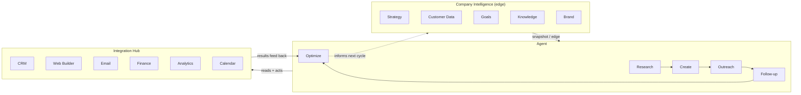

# Ingenium

A standalone Python package implementing a two-hemisphere business
intelligence and execution system. It is completely independent of the PWA
digital business card and the `robot_agi/` package that also live in this
repo.

## Concept

Ingenium has two hemispheres joined by a shared integration layer:

- **Company Intelligence** (the company's *edge*) — strategy, customer data,
  goals, knowledge, and brand. This is what the company knows about itself
  and its market.
- **Agent** (the *doing* side) — research, create, outreach, follow-up, and
  optimize. This is what acts on that knowledge.

Both hemispheres read and write through one **integration layer**: CRM, web
builder, email, finance, analytics, and calendar. That layer is what lets the
brain **think** (build context from the company edge), **connect** (wire
both hemispheres to real systems), and **execute** (run the agent pipeline
against that context and those systems).



## How the loop runs

1. **Think** — `CompanyIntelligence.snapshot()` collects the current state of
   strategy, customer data, goals, knowledge, and brand into one "edge"
   context object for a given objective.
2. **Connect** — `IntegrationHub.connect_all()` wires up CRM, web builder,
   email, finance, analytics, and calendar so both hemispheres can act
   through real systems (adapters are stubbed in-memory today; swap each
   adapter's internals for a real API client without touching the rest of
   the brain).
3. **Execute** — `AgentSide.execute_pipeline()` runs the five agent stages in
   order, each stage reading the edge and/or prior stage output and acting
   through the hub:
   - **Research** — reads CRM pipeline + analytics history + strategic
     priorities to understand the objective.
   - **Create** — drafts an on-brand asset (voice/tone from Brand,
     facts from Knowledge) and publishes it via the web builder.
   - **Outreach** — emails the relevant customer segment and logs the touch
     in the CRM.
   - **Follow-up** — schedules a calendar touchpoint for everyone reached.
   - **Optimize** — reads analytics + finance results back and recommends
     whether to scale or gather more data — closing the loop back to
     Company Intelligence for the next cycle.

## Structure

```
ingenium/
├── core/
│   ├── brain.py            # Ingenium: think() / connect() / execute()
│   └── integration_hub.py  # Owns and connects the six integrations
├── company_intelligence/    # strategy, customer_data, goals, knowledge, brand
├── agent/                   # research, create, outreach, follow_up, optimize
├── integrations/            # crm, web_builder, email, finance, analytics, calendar
├── web/                      # stdlib-only HTTP server + HTML dashboard
│   ├── server.py
│   └── static/               # index.html, style.css, app.js
└── tests/
    ├── test_brain.py
    └── test_web.py
```

## Usage

```python
from ingenium import Ingenium

brain = Ingenium()

# Populate the company edge once.
brain.company_intelligence.strategy.set_positioning("AI ops partner for local service businesses")
brain.company_intelligence.customer_data.upsert_record("cust-1", {"email": "lead@example.com"})
brain.company_intelligence.brand.set_voice("direct, confident, no fluff", ["clear", "bold"])

# Think, connect, and execute against an objective.
report = brain.execute("Launch fall tune-up campaign")
```

`report` contains the company edge used, the status of every integration,
and each agent stage's output — a full record of what the brain knew,
connected to, and did.

## Running tests

From the repo root:

```bash
python3 -m unittest discover -s ingenium/tests -v
```

## HTML dashboard

`ingenium/web/` is a stdlib-only HTTP server (no new dependencies) that
serves an HTML dashboard for the brain:

```bash
python3 -m ingenium.web.server
# -> open http://localhost:8000
```

The dashboard shows both hemispheres and the six integrations live, and lets
you type an objective and run a full think → connect → execute cycle from the
browser — the Company Intelligence cards, integration badges, and each Agent
stage update in place with the resulting report. The underlying `Ingenium`
instance is held in memory by the server process, so state (CRM activity,
sent emails, scheduled follow-ups, tracked analytics) accumulates across
runs, the same way the brain would in real use.

It exposes two JSON endpoints the dashboard's JS calls, which you can also
hit directly:

- `GET /api/edge` — the current company intelligence snapshot.
- `POST /api/execute` with `{"objective": "..."}` — runs the full pipeline
  and returns the same report shape as `Ingenium.execute()`.

## Running in a container (Podman / Rancher Desktop / Docker)

A `Containerfile` at the repo root packages `ingenium/` as a standalone
image with no dependencies beyond the Python standard library. Building it
also runs the full test suite — the build fails if a test fails.

```bash
# Podman (or Podman Desktop's embedded CLI, or Rancher Desktop set to the
# Podman/moby backend):
podman build -t ingenium -f Containerfile .
podman run --rm -p 8000:8000 ingenium
# -> open http://localhost:8000

# Docker works identically:
docker build -t ingenium -f Containerfile .
docker run --rm -p 8000:8000 ingenium
```

The default command runs the HTML dashboard (`ingenium.web.server`) on
port 8000. For the one-shot CLI report instead:

```bash
podman run --rm ingenium python3 -m ingenium.demo
```

That populates the same sample company edge (strategy, one customer record,
a goal, a knowledge entry, brand voice) and executes one full
think → connect → execute cycle, printing the resulting report as JSON.

## Extending with real integrations

Every adapter in `integrations/` extends `Integration` (`integrations/base.py`),
which only requires a `connect()` call before use. Replace an adapter's
in-memory logic with a real API client (e.g. a CRM's REST API, an ESP for
email, a scheduling API for calendar) and the rest of the brain — both
hemispheres and the pipeline — keeps working unchanged.
