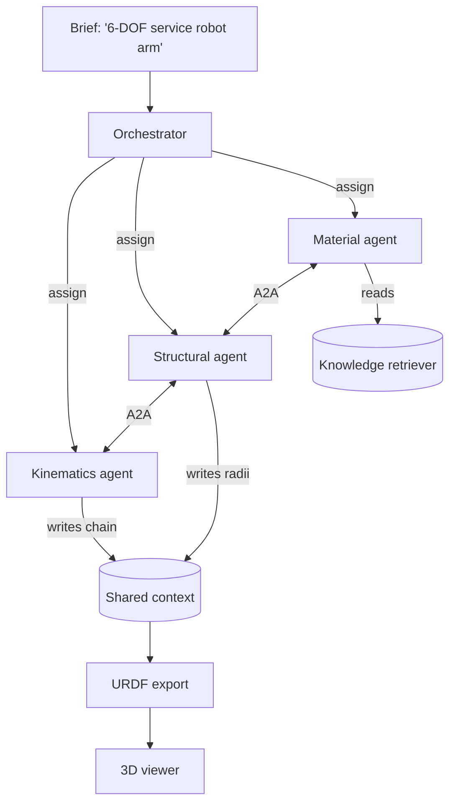

# Agentic Orchestration + Robot Design

A hierarchical multi-agent system: a central **orchestrator** delegates to
specialized **sub-agents** that collaborate through a shared context and an
agent-to-agent (A2A) message bus. The first domain built on it is **robot
design** — turning a natural-language brief into a real robot description
(URDF) and a 3D preview.

Everything here runs locally with **no external services, no API keys, and no
dependencies beyond the Python standard library**. Where the larger vision
calls for heavier infrastructure, this ships the *interface* so it can be
plugged in later (see "Plug-in points").

## What's real today

```bash
# Design a robot from a brief; print the report and export URDF + JSON
python3 -m robot_agi.design_demo "6-DOF humanoid service robot arm" --out ./out

# Open the 3D viewer (double-click), then "Load design.json" from ./out
robot_agi/design/viewer.html
```

- **Orchestrator + sub-agents** (`orchestration/`) — an `Orchestrator` runs a
  pipeline of `Agent`s over a shared context (a blackboard). Each agent reads
  the prior agents' output, consults knowledge, and records A2A messages on a
  `MessageBus` for full traceability.
- **Robot-design agents** (`design/agents.py`):
  - **Kinematics** builds the link/joint chain for the requested limb + DOF.
  - **Structural** sizes each link's cross-section from downstream load.
  - **Material** assigns steel → aluminium → carbon-fibre by position and
    computes each link's mass (consulting the knowledge retriever).
- **URDF export** (`design/urdf.py`) — emits standards-compliant URDF XML
  (links with visual + inertial, joints with axes and limits) that loads in
  ROS / Gazebo / any URDF tool.
- **3D viewer** (`design/viewer.html`) — a self-contained canvas renderer that
  runs forward kinematics and draws the articulated linkage, colored by
  material, orbitable with the mouse. Load any `design.json` the demo writes.



## Plug-in points (for the fuller vision)

The system is structured so the heavier pieces slot in without rewriting the
core. Each is an interface with a working in-memory default today:

| Vision piece | Where it plugs in | Default today |
|---|---|---|
| RAG / vector DB (LlamaIndex, Pinecone, ChromaDB) | `KnowledgeRetriever.retrieve()` in `orchestration/knowledge.py` | in-memory keyword store |
| LLM-backed agents (LangGraph) | subclass `Agent.run()` to call an LLM/graph | deterministic domain logic |
| A2A transport / MCP | `MessageBus.send()` | in-process message log |
| More domains (planning, sourcing, sensors, viz) | new `Agent`s + pipeline stages | kinematics / structural / material |

These need API keys, paid accounts, and network access, so they are **not**
wired up here — but the seams exist so adding one is a localized change.

## Running the tests

```bash
python3 -m unittest robot_agi.tests.test_orchestration -v
# or the whole robot_agi suite:
python3 -m unittest discover -s robot_agi/tests -v
```
